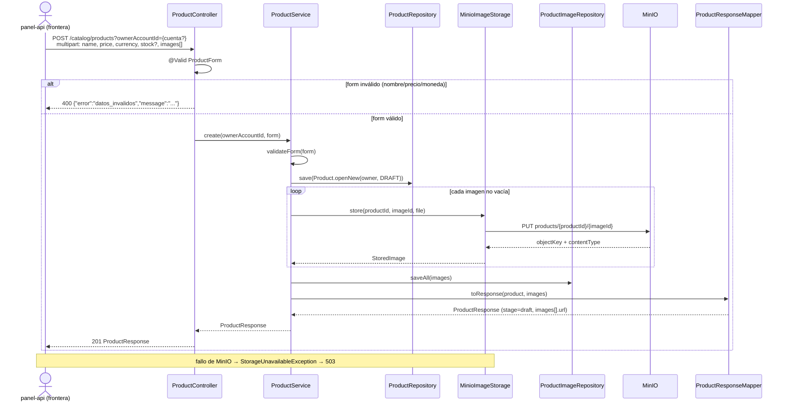
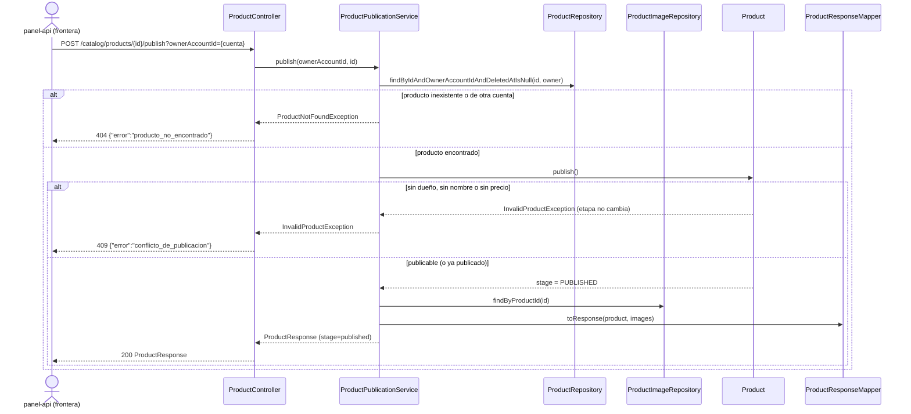
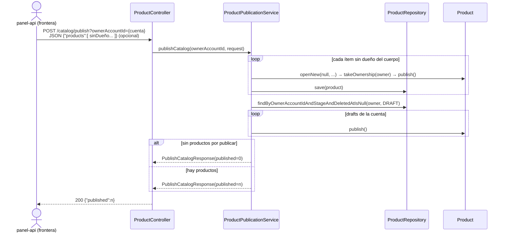
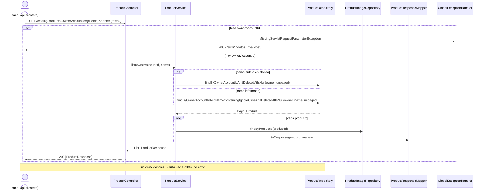

# UML 001 — Productos con etapa y dueño, e imágenes en MinIO

Diagramas **as-built** alineados con `spec.md`, `plan.md` y `tasks.md`, y con las
convenciones de `catalog-api` (`AGENTS.md`: Java 25 / Spring Boot 4.1, paquete
`com.friendlyeshop.catalog`, arquitectura **Layered** con extensiones
`client/storage` y `mapper`). Prosa en español; diagramas en Mermaid con los
nombres reales de clases.

## 1. Contexto

`catalog-api` es la fuente de verdad de productos, precios, stock e imágenes. El
panel llega a través de la frontera `panel-api`, que valida la sesión y fija el
`ownerAccountId`; este servicio no autentica. Las imágenes se suben dentro del
alta/edición del producto (`multipart/form-data` en `POST`/`PUT
/catalog/products`) y se guardan en MinIO; se leen por una URL pública servida por
este servicio (`GET /catalog/images/{imageId}`), de modo que el consumidor nunca
usa credenciales de MinIO. El borrado es lógico y conserva los objetos. Los
endpoints de Actuator (`health`, `info`, `prometheus`) se conservan para
Kubernetes; no se expone una lectura global del catálogo publicado.

## 2. Diagrama de componentes

```mermaid
flowchart TB
  subgraph panel [panel-web / panel-api]
    Frontier["Frontera /panel/catalog<br/>fija ownerAccountId"]
  end

  subgraph catalogApi [catalog-api]
    subgraph controllers [controller]
      ProductCtrl[ProductController<br/>/catalog/products<br/>list·create·update·delete·publish·unpublish·publishCatalog]
      ImageCtrl[ProductImageController<br/>/catalog/images/{id}]
    end

    subgraph services [service]
      ProductSvc[ProductService<br/>list(owner, name)·create·update·deleteLogically]
      PublishSvc[ProductPublicationService<br/>publish·unpublish·publishCatalog]
    end

    subgraph repos [repository]
      ProductRepo[ProductRepository<br/>+ filtro por nombre]
      ImageRepo[ProductImageRepository]
    end

    subgraph domain [model]
      Product[Product]
      ProductImage[ProductImage]
      Stage[ProductStage + Converter]
      Curr[Currency]
    end

    subgraph storage [client/storage]
      Storage[ImageStorage]
      Minio[MinioImageStorage]
    end

    Mapper[ProductResponseMapper]
    Errors[GlobalExceptionHandler]
    Config["config<br/>StorageProperties · CatalogProperties · StorageConfig<br/>@ConfigurationPropertiesScan"]
  end

  subgraph external [Infraestructura]
    MinioS3[(MinIO / S3<br/>bucket product-images)]
    DB[(PostgreSQL<br/>base catalog)]
  end

  Frontier -->|"POST/PUT multipart + ownerAccountId"| ProductCtrl
  Frontier -->|"publish/unpublish/publish catalog"| ProductCtrl
  Frontier -->|"GET list ?ownerAccountId=&name="| ProductCtrl
  ProductCtrl --> ProductSvc
  ProductCtrl --> PublishSvc
  ImageCtrl --> ImageRepo
  ImageCtrl --> Storage
  ProductSvc --> ProductRepo
  ProductSvc --> ImageRepo
  ProductSvc --> Storage
  ProductSvc --> Mapper
  PublishSvc --> ProductRepo
  PublishSvc --> ImageRepo
  PublishSvc --> Mapper
  Storage -.implementa.-> Minio
  Minio -->|S3_*| MinioS3
  ProductRepo --> DB
  ImageRepo --> DB
  Mapper --> CatalogProps[CatalogProperties<br/>PUBLIC_API_BASE_URL]
  Config --> Minio
```

Variables de entorno relevantes: `S3_ENDPOINT`, `S3_BUCKET`, `S3_ACCESS_KEY`,
`S3_SECRET_KEY` (almacenamiento) y `PUBLIC_API_BASE_URL` (base de la URL pública
de imágenes). El bucket `product-images` y las credenciales pertenecen a `infra`.

## 3. Diagrama de clases (Layered)

Se muestran relaciones arquitectónicas relevantes; no se reproduce cada import ni
variable local. Los DTOs y errores se citan como contratos de frontera.

```mermaid
classDiagram
  direction TB

  class ProductController {
    -ProductService productService
    -ProductPublicationService publicationService
    +list(ownerAccountId, name) List~ProductResponse~
    +create(ownerAccountId?, form) ProductResponse
    +update(ownerAccountId, id, form) ProductResponse
    +delete(ownerAccountId, id) void
    +publish(ownerAccountId, id) ProductResponse
    +unpublish(ownerAccountId, id) ProductResponse
    +publishCatalog(ownerAccountId, request?) PublishCatalogResponse
  }

  class ProductImageController {
    -ProductImageRepository productImageRepository
    -ImageStorage imageStorage
    +read(imageId) ResponseEntity~Resource~
  }

  class ProductService {
    -ProductRepository productRepository
    -ProductImageRepository productImageRepository
    -ImageStorage imageStorage
    -ProductResponseMapper responseMapper
    +list(ownerAccountId, name) List~ProductResponse~
    +create(ownerAccountId, form) ProductResponse
    +update(ownerAccountId, id, form) ProductResponse
    +deleteLogically(ownerAccountId, id) void
  }

  class ProductPublicationService {
    -ProductRepository productRepository
    -ProductImageRepository productImageRepository
    -ProductResponseMapper responseMapper
    +publish(ownerAccountId, id) ProductResponse
    +unpublish(ownerAccountId, id) ProductResponse
    +publishCatalog(ownerAccountId, request) PublishCatalogResponse
  }

  class ProductRepository {
    <<interface>>
    +findByOwnerAccountIdAndDeletedAtIsNull(owner, pageable) Page~Product~
    +findByOwnerAccountIdAndNameContainingIgnoreCaseAndDeletedAtIsNull(owner, name, pageable) Page~Product~
    +findByIdAndOwnerAccountIdAndDeletedAtIsNull(id, owner) Optional~Product~
    +findByOwnerAccountIdAndStageAndDeletedAtIsNull(owner, stage) List~Product~
  }

  class ProductImageRepository {
    <<interface>>
    +findByProductId(productId) List~ProductImage~
    +findById(id) Optional~ProductImage~
  }

  class Product {
    <<entity>>
    -UUID id
    -UUID ownerAccountId
    -String name
    -BigDecimal price
    -Currency currency
    -Integer stock
    -ProductStage stage
    -Instant deletedAt
    -long version
    -Instant createdAt
    -Instant updatedAt
    +openNew(...)$ Product
    +update(...) void
    +publish() void
    +unpublish() void
    +takeOwnership(accountId) void
    +deleteLogically(now) void
    +isDeleted() boolean
    +belongsTo(accountId) boolean
  }

  class ProductImage {
    <<entity>>
    -UUID id
    -UUID productId
    -String objectKey
    -String contentType
    -Instant createdAt
    +of(...)$ ProductImage
  }

  class ProductStage {
    <<enum>>
    DRAFT
    PUBLISHED
    +value() String
    +from(value)$ ProductStage
  }
  class ProductStageConverter {
    <<converter>>
    +convertToDatabaseColumn(stage) String
    +convertToEntityAttribute(value) ProductStage
  }
  class Currency {
    <<enum>>
    ARS
    USD
    +from(value)$ Currency
  }

  class ImageStorage {
    <<interface>>
    +store(productId, imageId, file) StoredImage
    +load(objectKey) ImageContent
  }
  class MinioImageStorage {
    -MinioClient client
    -StorageProperties properties
    +store(productId, imageId, file) StoredImage
    +load(objectKey) ImageContent
  }
  class StorageProperties {
    -String endpoint
    -String bucket
    -String accessKey
    -String secretKey
  }
  class CatalogProperties {
    -String publicBaseUrl
  }

  class ProductResponseMapper {
    -CatalogProperties catalogProperties
    +toResponse(product, images) ProductResponse
  }

  class ProductResponse {
    <<record>>
    +UUID id
    +UUID ownerAccountId
    +String name
    +BigDecimal price
    +Currency currency
    +Integer stock
    +ProductStage stage
    +List~ProductImageResponse~ images
    +Instant createdAt
    +Instant updatedAt
  }
  class ProductImageResponse {
    <<record>>
    +UUID id
    +String url
  }
  class ProductForm {
    <<record>>
    +String name
    +BigDecimal price
    +Currency currency
    +Integer stock
    +List~MultipartFile~ images
  }
  class PublishCatalogItem {
    <<record>>
    +String name
    +BigDecimal price
    +Currency currency
    +Integer stock
  }
  class PublishCatalogRequest {
    <<record>>
    +List~PublishCatalogItem~ products
  }
  class PublishCatalogResponse {
    <<record>>
    +int published
  }
  class ErrorResponse {
    <<record>>
    +String error
    +String message
  }

  class GlobalExceptionHandler
  class ProductNotFoundException
  class InvalidProductException
  class StorageUnavailableException

  ProductController --> ProductService
  ProductController --> ProductPublicationService
  ProductImageController --> ProductImageRepository
  ProductImageController --> ImageStorage
  ProductService --> ProductRepository
  ProductService --> ProductImageRepository
  ProductService --> ImageStorage
  ProductService --> ProductResponseMapper
  ProductPublicationService --> ProductRepository
  ProductPublicationService --> ProductImageRepository
  ProductPublicationService --> ProductResponseMapper
  ProductResponseMapper --> CatalogProperties
  ProductResponseMapper ..> ProductResponse
  ProductResponseMapper ..> ProductImageResponse
  ProductRepository ..> Product
  ProductImageRepository ..> ProductImage
  Product --> ProductStage
  Product --> Currency
  ProductStageConverter ..> ProductStage
  MinioImageStorage ..|> ImageStorage
  MinioImageStorage --> StorageProperties
  GlobalExceptionHandler --> ProductNotFoundException
  GlobalExceptionHandler --> InvalidProductException
  GlobalExceptionHandler --> StorageUnavailableException
  GlobalExceptionHandler ..> ErrorResponse
```



## 4. Secuencia — alta con imágenes

Alta `multipart` con `ownerAccountId` opcional, persistencia en `draft` y guardado
de cada imagen en MinIO antes de responder. Cubre las validaciones declarativas.



## 5. Secuencia — publicar

Publica un producto `draft` de la cuenta; valida dueño, nombre y precio sin cambiar
la etapa si falta alguno.



## 6. Secuencia — publicar catálogo

`POST /catalog/publish` publica los productos de la sesión: los ítems sin dueño
del cuerpo (creados y tomados con el dueño de la cuenta) más los `draft` ya
asociados a la cuenta. Sin productos por publicar, responde 0 sin error.



## 7. Secuencia — listar con filtro

`GET /catalog/products` exige `ownerAccountId` y acepta `name`. Con nombre filtra
por coincidencia parcial ignorando mayúsculas; sin nombre (o en blanco) lista todo
lo de la cuenta. Los borrados nunca aparecen.



Notas de contrato:

- `ownerAccountId` viaja como **query param autoritativo**; un valor en el cuerpo se
  ignora. Las consultas y mutaciones siempre están acotadas a esa cuenta.
- `name` filtra por coincidencia parcial (`contains`) e ignora mayúsculas.
- Las imágenes se referencian como
  `{PUBLIC_API_BASE_URL}/catalog/images/{imageId}`, servidas por
  `ProductImageController` con `Cache-Control: public, max-age=86400`; el
  consumidor no recibe credenciales de MinIO.

## 8. Traducción de errores

| Origen | Resultado de `catalog-api` | RF |
|---|---|---|
| Falta `ownerAccountId` u otro parámetro obligatorio | `400` `{"error":"datos_invalidos","message":"..."}` | RF-7 |
| `ProductForm`/JSON inválidos (nombre, precio, moneda, stock) | `400` `{"error":"datos_invalidos","message":"..."}` | RF-21 |
| Producto o imagen inexistente, o de otra cuenta | `404` `{"error":"producto_no_encontrado","message":"..."}` | RF-23 |
| Publicar sin dueño, nombre o precio | `409` `{"error":"conflicto_de_publicacion","message":"..."}` | RF-12 |
| Fallo de MinIO | `503` `{"error":"almacenamiento_no_disponible","message":"..."}` | caso límite |
